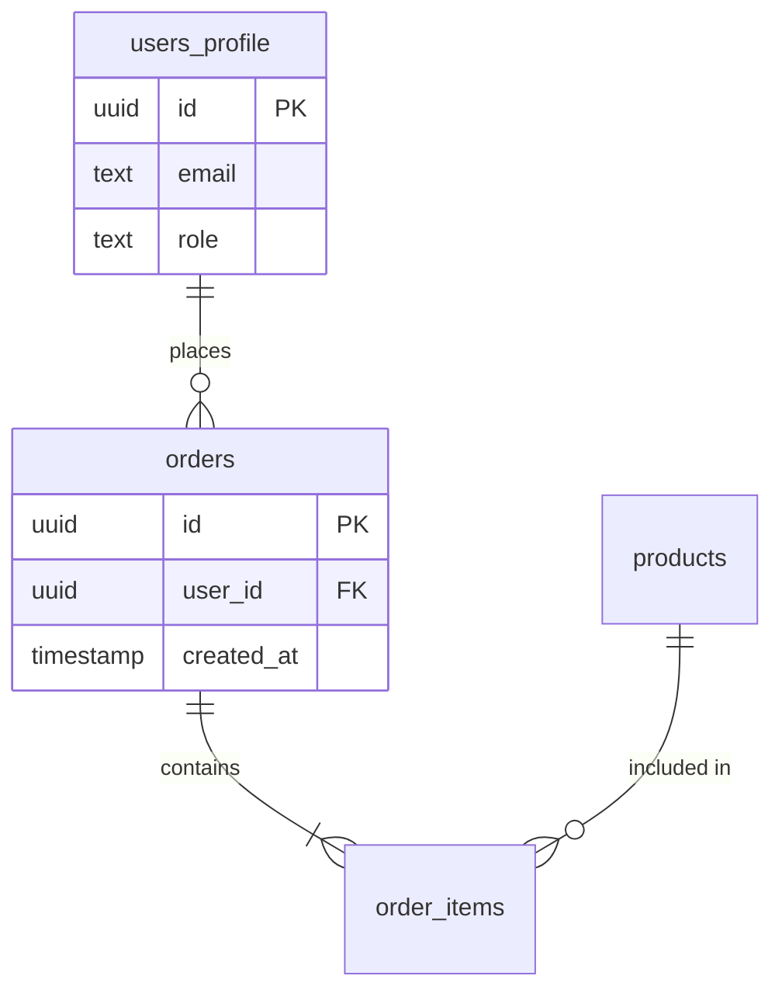
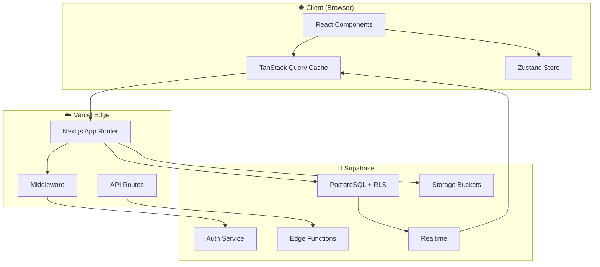
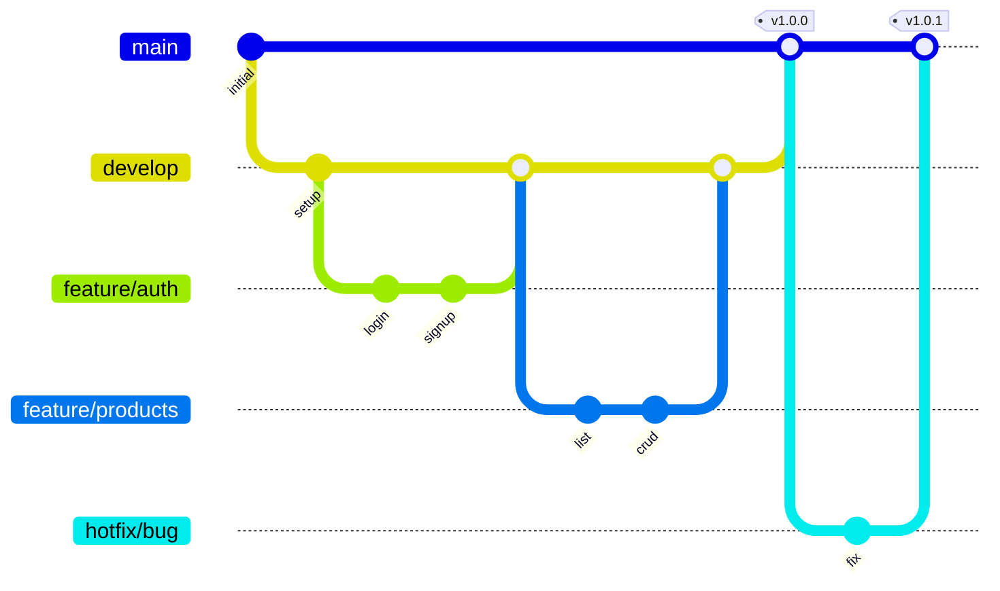

# 🏗️ Agency Project Development Workflow (SOP)

> **Stack:** Google Antigravity AI + Supabase + GitHub + Vercel  
> **Target:** 100,000+ users scalability | Zero-downtime | Self-documenting codebase

> **📂 Companion Files:**
>
> - [ai-rules.md](../.agent/workflows/ai-rules.md) - AI enforcer instructions for Antigravity IDE
> - Place this in `.agent/workflows/` for automatic AI loading

---

## 📋 Table of Contents

1. [Phase 0: Project Kickoff & Requirements](#phase-0-project-kickoff--requirements)
2. [Phase 1: Architecture & Database Design](#phase-1-architecture--database-design)
3. [Phase 2: Supabase Setup & Security](#phase-2-supabase-setup--security)
4. [Phase 3: Frontend Foundation](#phase-3-frontend-foundation)
5. [Phase 4: Backend Implementation](#phase-4-backend-implementation)
6. [Phase 5: Integration & Alignment](#phase-5-integration--alignment)
7. [Phase 6: Testing & Quality Assurance](#phase-6-testing--quality-assurance)
8. [Phase 7: Deployment Pipeline](#phase-7-deployment-pipeline)
9. [Phase 8: Monitoring & Maintenance](#phase-8-monitoring--maintenance)
10. [Advanced Patterns](#advanced-patterns)
11. [Documentation Standards](#documentation-standards)
12. [Emergency Protocols](#emergency-protocols)
13. [Quick Reference Commands](#quick-reference-commands)

---

## Phase 0: Project Kickoff & Requirements

### 0.1 Requirements Gathering Checklist

- [ ] **Product Requirements Document (PRD.md)** ⭐ _From Gemini_

  - Product vision and objectives
  - User personas with pain points
  - Feature specifications with acceptance criteria
  - Data flow diagrams
  - User permissions matrix
  - **Purpose:** Let AI understand "WHY" we build, not just "HOW"

- [ ] **Business Requirements Document (BRD)**

  - Define core business objectives
  - Identify target user personas (min 3)
  - List must-have vs nice-to-have features
  - Define success metrics (KPIs)

- [ ] **Technical Requirements Document (TRD)**

  - Expected user load (peak/average)
  - Data sensitivity classification
  - Third-party integrations needed
  - Performance requirements (response times)

- [ ] **User Stories & Acceptance Criteria**
  - Format: `As a [persona], I want to [action] so that [benefit]`
  - Each story has testable acceptance criteria
  - Priority: P0 (blocker), P1 (critical), P2 (important), P3 (nice-to-have)

### 0.2 Visual Planning First ⭐ _From Earlier Conversation_

> **"Don't open your IDE before you finish this step. Chaos here means catastrophe later."**

**Use [Eraser.io](https://eraser.io) or pen & paper:**

1. **Draw all entities** (Users, Products, Orders, etc.)
2. **Define relationships** (One-to-Many, Many-to-Many)
3. **Export as Mermaid code or image**



**Why visual first?**

- AI understands diagrams with 90% less ambiguity than text descriptions
- Paste the image/mermaid to any AI and it will generate perfect SQL
- Prevents the #1 mistake: inventing fields that don't exist

### 0.3 Project Structure Initialization

```bash
# Create project root with standardized structure
mkdir -p project-name/{
  .github/workflows,
  docs/{architecture,api,guides,decisions},
  src/{components,hooks,lib,pages,styles,types,utils},
  supabase/{migrations,functions,seed},
  tests/{unit,integration,e2e},
  scripts
}
```

### 0.4 Create Project Manifest

Create `PROJECT_MANIFEST.md` at root:

```markdown
# Project: [NAME]

## Version: 0.0.1

## Created: [DATE]

## Last Updated: [DATE]

### Quick Links

- Production: [URL]
- Staging: [URL]
- Supabase Dashboard: [URL]
- GitHub Repo: [URL]
- Vercel Dashboard: [URL]

### Team

| Role           | Name | Contact |
| -------------- | ---- | ------- |
| Lead Developer |      |         |
| Designer       |      |         |
| Product Owner  |      |         |

### Environment Variables Required

| Variable                      | Purpose      | Where to get         |
| ----------------------------- | ------------ | -------------------- |
| NEXT_PUBLIC_SUPABASE_URL      | Supabase API | Dashboard > Settings |
| NEXT_PUBLIC_SUPABASE_ANON_KEY | Public Auth  | Dashboard > Settings |
| SUPABASE_SERVICE_ROLE_KEY     | Admin ops    | Dashboard > Settings |

### Critical Decisions Log

| Date | Decision | Rationale | Who |
| ---- | -------- | --------- | --- |
|      |          |           |     |
```

### 0.5 Comprehensive Implementation Plan ⭐ _Critical Deliverable_

> **Purpose:** The master blueprint that guides the entire project from start to finish.
> This is the GPS that ensures we never get lost.

Create `docs/IMPLEMENTATION_PLAN.md`:

```markdown
# 📋 Implementation Plan: [PROJECT NAME]

## Executive Summary

**Project Name:** [Name]
**Client:** [Client Name]
**Start Date:** [Date]
**Target Launch:** [Date]
**Total Estimated Hours:** [X hours]

---

## 🎯 Project Scope

### In Scope

| Feature             | Description                   | Priority |
| ------------------- | ----------------------------- | -------- |
| User Authentication | Email/Password + Google OAuth | P0       |
| [Feature 2]         |                               |          |

### Out of Scope (Explicitly Excluded)

| Feature    | Reason            | Future Phase? |
| ---------- | ----------------- | ------------- |
| Mobile App | Budget constraint | Phase 2       |
|            |                   |               |

---

## 🏗️ Architecture Overview

### Tech Stack

| Layer        | Technology              | Justification          |
| ------------ | ----------------------- | ---------------------- |
| Frontend     | Next.js 14              | App Router, SSR        |
| Backend      | Supabase Edge Functions | Serverless, PostgreSQL |
| Database     | Supabase PostgreSQL     | RLS, Realtime          |
| Hosting      | Vercel                  | Auto-deploy, Edge      |
| AI Assistant | Google Antigravity      | Code generation        |

### System Diagram

[Mermaid diagram or image]

---

## 📅 Phase Breakdown

### Phase 1: Foundation (Week 1-2)

**Goal:** Project setup, database, authentication
**Hours:** [X hours]
**Deliverables:**

- [ ] Project repository configured
- [ ] Database schema created
- [ ] Auth system working
- [ ] RLS policies active

### Phase 2: Core Features (Week 3-4)

**Goal:** Main business logic and UI
**Hours:** [X hours]
**Deliverables:**

- [ ] [Feature 1] complete
- [ ] [Feature 2] complete

### Phase 3: Polish & Testing (Week 5)

**Goal:** Testing, bug fixes, optimization
**Hours:** [X hours]
**Deliverables:**

- [ ] All tests passing
- [ ] Performance optimized
- [ ] Security audit complete

### Phase 4: Deployment (Week 6)

**Goal:** Production launch
**Hours:** [X hours]
**Deliverables:**

- [ ] Staging tested
- [ ] Production deployed
- [ ] Client handover complete

---

## 🚨 Risk Assessment

| Risk                    | Probability | Impact | Mitigation                    |
| ----------------------- | ----------- | ------ | ----------------------------- |
| Scope creep             | High        | High   | Strict change request process |
| Third-party API failure | Medium      | High   | Fallback mechanisms           |
|                         |             |        |                               |

---

## 📞 Communication Plan

| Meeting           | Frequency | Attendees     | Purpose                |
| ----------------- | --------- | ------------- | ---------------------- |
| Progress Update   | Weekly    | Client + Lead | Status review          |
| Tech Sync         | Daily     | Dev team      | Blockers               |
| Checkpoint Review | Per phase | All           | Deliverable validation |

---

## ✅ Sign-Off

| Role         | Name | Date | Signature |
| ------------ | ---- | ---- | --------- |
| Client       |      |      |           |
| Project Lead |      |      |           |
| Developer    |      |      |           |
```

---

### 0.6 All-Inclusive Task List ⭐ _Critical Deliverable_

> **Purpose:** Every single task needed to complete the project.
> Even if 1000+ tasks, no problem. This is our execution checklist.
> Nothing gets forgotten.

Create `docs/TASK_LIST.md`:

```markdown
# 📝 Master Task List: [PROJECT NAME]

> **Legend:**
>
> - [ ] Not started
> - [/] In progress
> - [x] Completed
> - ⭕ Blocked
> - ⚠️ Needs review

---

## Phase 0: Planning & Setup

**Target:** [Date] | **Status:** [ ] Not Started

### 0.1 Project Initialization

- [ ] Clone agency-starter-kit template
- [ ] Update package.json with project name
- [ ] Create Supabase project
- [ ] Configure environment variables (.env.local)
- [ ] Verify local development works (`npm run dev`)

### 0.2 Documentation

- [ ] Create PRD.md
- [ ] Create IMPLEMENTATION_PLAN.md
- [ ] Create this TASK_LIST.md
- [ ] Create KPI_DEFINITIONS.md
- [ ] Draw ER diagram (Eraser.io)
- [ ] Get client approval on scope

### 0.3 Repository Setup

- [ ] Initialize Git repository
- [ ] Create GitHub repository
- [ ] Configure branch protection rules
- [ ] Set up CI/CD pipeline
- [ ] Configure Vercel project

---

## Phase 1: Database & Authentication

**Target:** [Date] | **Status:** [ ] Not Started

### 1.1 Database Schema

- [ ] Design users_profile table
- [ ] Design [table_2] table
- [ ] Design [table_3] table
- [ ] Create migration: 00001_initial_schema.sql
- [ ] Create migration: 00002\_[name].sql
- [ ] Run migrations locally
- [ ] Generate TypeScript types

### 1.2 Row Level Security

- [ ] Write RLS policy: users can view own data
- [ ] Write RLS policy: users can update own data
- [ ] Write RLS policy: admins can view all
- [ ] Write RLS policy: [custom policy]
- [ ] Test RLS with different user roles

### 1.3 Database Triggers

- [ ] Create trigger: on_auth_user_created
- [ ] Create trigger: [custom trigger]
- [ ] Test all triggers

### 1.4 Authentication

- [ ] Set up Supabase Auth
- [ ] Create login page
- [ ] Create signup page
- [ ] Create password reset flow
- [ ] Test auth flow end-to-end

---

## Phase 2: Core Features

**Target:** [Date] | **Status:** [ ] Not Started

### 2.1 Feature: [Feature Name]

#### Service Layer

- [ ] Create [feature].service.ts
- [ ] Implement getAll() function
- [ ] Implement getById() function
- [ ] Implement create() function
- [ ] Implement update() function
- [ ] Implement delete() function

#### Custom Hooks

- [ ] Create use[Feature].ts hook
- [ ] Implement useQuery for fetching
- [ ] Implement useMutation for create
- [ ] Implement useMutation for update
- [ ] Implement useMutation for delete

#### UI Components

- [ ] Create [Feature]List.tsx
- [ ] Create [Feature]Card.tsx
- [ ] Create [Feature]Form.tsx
- [ ] Create [Feature]Detail.tsx
- [ ] Add loading states (Skeleton)
- [ ] Add error states
- [ ] Add empty states

#### Pages

- [ ] Create /[feature] list page
- [ ] Create /[feature]/[id] detail page
- [ ] Create /[feature]/new create page
- [ ] Create /[feature]/[id]/edit edit page

### 2.2 Feature: [Feature 2 Name]

[Repeat same structure]

---

## Phase 3: Testing & QA

**Target:** [Date] | **Status:** [ ] Not Started

### 3.1 Unit Tests

- [ ] Test utility functions
- [ ] Test service layer functions
- [ ] Test custom hooks
- [ ] Achieve 80% coverage

### 3.2 Integration Tests

- [ ] Test API endpoints
- [ ] Test database operations
- [ ] Test authentication flow

### 3.3 E2E Tests

- [ ] Test user registration flow
- [ ] Test login flow
- [ ] Test [main feature] CRUD
- [ ] Test [critical user journey]

### 3.4 Manual QA

- [ ] Test on Chrome
- [ ] Test on Firefox
- [ ] Test on Safari
- [ ] Test on mobile (iOS)
- [ ] Test on mobile (Android)
- [ ] Verify responsive design

### 3.5 Security Audit

- [ ] Review all RLS policies
- [ ] Check for exposed secrets
- [ ] Test for SQL injection
- [ ] Test for XSS
- [ ] Run Lighthouse audit

---

## Phase 4: Deployment

**Target:** [Date] | **Status:** [ ] Not Started

### 4.1 Staging Deployment

- [ ] Deploy to staging environment
- [ ] Run full test suite on staging
- [ ] Client UAT (User Acceptance Testing)
- [ ] Fix UAT issues

### 4.2 Production Preparation

- [ ] Configure production environment variables
- [ ] Set up production Supabase project
- [ ] Configure custom domain
- [ ] Set up Sentry error tracking
- [ ] Configure backup strategy

### 4.3 Go Live

- [ ] Deploy to production
- [ ] Verify production is working
- [ ] Set up monitoring alerts
- [ ] Create rollback plan

### 4.4 Handover

- [ ] Create user documentation
- [ ] Create admin documentation
- [ ] Training session with client
- [ ] Transfer credentials securely
- [ ] Final sign-off

---

## 📊 Progress Summary

| Phase     | Total Tasks | Completed | Remaining | % Done |
| --------- | ----------- | --------- | --------- | ------ |
| Phase 0   |             |           |           | 0%     |
| Phase 1   |             |           |           | 0%     |
| Phase 2   |             |           |           | 0%     |
| Phase 3   |             |           |           | 0%     |
| Phase 4   |             |           |           | 0%     |
| **TOTAL** |             |           |           | **0%** |

---

## 🔄 Task List Changelog

| Date   | Change                    | By     |
| ------ | ------------------------- | ------ |
| [Date] | Initial task list created | [Name] |
|        |                           |        |
```

---

### 0.7 KPI Definitions & "Done" Criteria ⭐ _Critical Deliverable_

> **Purpose:** Explicitly define what "DONE" means for every task and phase.
> No ambiguity. No "almost done". Either it passes the criteria, or it's not done.

Create `docs/KPI_DEFINITIONS.md`:

````markdown
# 📊 KPI Definitions & Done Criteria: [PROJECT NAME]

> **Golden Rule:** A task is NOT done until ALL its criteria are met.
> "Almost done" = Not done.

---

## 🎯 Phase-Level KPIs

### Phase 0: Planning - DONE when:

| Criteria                             | Verification Method       | Owner |
| ------------------------------------ | ------------------------- | ----- |
| PRD.md exists and approved by client | Client signature          | PM    |
| IMPLEMENTATION_PLAN.md exists        | File exists in /docs      | Lead  |
| TASK_LIST.md has all tasks listed    | File exists, no TBD items | Lead  |
| KPI_DEFINITIONS.md complete          | This file exists          | Lead  |
| ER diagram drawn and approved        | Image/Mermaid in docs     | Lead  |
| Client signed off on scope           | Email/Document            | PM    |

### Phase 1: Database - DONE when:

| Criteria                    | Verification Method                         | Owner |
| --------------------------- | ------------------------------------------- | ----- |
| All tables created          | `npx supabase db diff` returns no changes   | Dev   |
| All RLS policies active     | Manual testing with different roles         | Dev   |
| TypeScript types generated  | `src/types/supabase.ts` up to date          | Dev   |
| Auth flow works end-to-end  | Can register, login, logout, reset password | QA    |
| No security vulnerabilities | Security checklist all green                | Lead  |

### Phase 2: Features - DONE when:

| Criteria                 | Verification Method                    | Owner |
| ------------------------ | -------------------------------------- | ----- |
| All CRUD operations work | Manual testing                         | QA    |
| Loading states visible   | UI shows skeleton/spinner              | QA    |
| Error states handled     | Try invalid inputs, get friendly error | QA    |
| Empty states visible     | Delete all items, see empty message    | QA    |
| Mobile responsive        | Test on phone                          | QA    |
| No console errors        | Browser console clean                  | Dev   |

### Phase 3: Testing - DONE when:

| Criteria                    | Verification Method     | Owner |
| --------------------------- | ----------------------- | ----- |
| Unit test coverage ≥ 80%    | `npm run test:coverage` | Dev   |
| All E2E tests pass          | `npm run e2e` green     | QA    |
| Lighthouse score ≥ 90       | Lighthouse audit        | Dev   |
| No critical security issues | Security audit report   | Lead  |
| All browsers tested         | QA checklist signed     | QA    |

### Phase 4: Deployment - DONE when:

| Criteria                   | Verification Method            | Owner |
| -------------------------- | ------------------------------ | ----- |
| Staging approved by client | Client email approval          | PM    |
| Production accessible      | Visit production URL           | All   |
| Monitoring active          | Sentry dashboard shows project | Dev   |
| Documentation complete     | All docs in /docs folder       | Lead  |
| Client trained             | Training session completed     | PM    |
| Final sign-off received    | Signed document                | PM    |

---

## 📋 Task-Level "Done" Definitions

### Code Task is DONE when:

- [ ] Code written and functions as expected
- [ ] No TypeScript errors (`npm run type-check` passes)
- [ ] No ESLint errors (`npm run lint` passes)
- [ ] Unit tests written (if applicable)
- [ ] Code reviewed (if team > 1)
- [ ] Committed with Conventional Commits format

### UI Component is DONE when:

- [ ] Renders correctly on desktop
- [ ] Renders correctly on mobile
- [ ] Loading state implemented
- [ ] Error state implemented
- [ ] Empty state implemented (if applicable)
- [ ] Accessible (keyboard navigation, proper labels)
- [ ] No console errors

### API Endpoint is DONE when:

- [ ] Endpoint accessible
- [ ] Returns correct data format
- [ ] Handles errors gracefully
- [ ] Authentication required (if protected)
- [ ] RLS policies working
- [ ] Documented in API reference

### Database Migration is DONE when:

- [ ] SQL file created in `supabase/migrations/`
- [ ] Migration runs without errors locally
- [ ] RLS enabled on new tables
- [ ] Policies created for new tables
- [ ] TypeScript types regenerated
- [ ] Tested with sample data

### Feature is DONE when:

- [ ] All related tasks completed
- [ ] Service layer complete
- [ ] Custom hooks complete
- [ ] UI components complete
- [ ] Pages complete
- [ ] Tests written and passing
- [ ] Manual QA passed
- [ ] Client approved (if major feature)

---

## 🚦 Status Definitions

| Status         | Meaning                           | Can Move Forward? |
| -------------- | --------------------------------- | ----------------- |
| ⬜ Not Started | Work has not begun                | No                |
| 🔵 In Progress | Actively being worked on          | No                |
| 🟡 In Review   | Waiting for review/approval       | No                |
| ⭕ Blocked     | Cannot proceed due to dependency  | No                |
| 🟢 Done        | All criteria met                  | ✅ YES            |
| 🔴 Failed      | Did not meet criteria, needs redo | No                |

---

## 📅 Checkpoint Reviews

### When to Review:

1. **End of each Phase** - Mandatory
2. **Before major feature starts** - Recommended
3. **When stuck/confused** - Compare current vs. plan
4. **Weekly** - Progress check

### Review Checklist:

```markdown
## Checkpoint Review: [Date]

### What was planned for this phase:

[Copy from IMPLEMENTATION_PLAN.md]

### What was actually completed:

[List completed tasks]

### What is missing:

[List incomplete tasks]

### Reasons for deviation:

[Explain any differences]

### Action items:

- [ ] [Item 1]
- [ ] [Item 2]

### Client informed:

[ ] Yes [ ] No (explain why)
```
````

---

## 📈 Success Metrics

### Project Health Indicators

| Metric                  | Target | Current | Status |
| ----------------------- | ------ | ------- | ------ |
| Tasks completed on time | ≥ 90%  | -       | -      |
| Bug escape rate         | < 5%   | -       | -      |
| Client satisfaction     | ≥ 8/10 | -       | -      |
| Scope change requests   | < 3    | -       | -      |
| Code coverage           | ≥ 80%  | -       | -      |
| Lighthouse score        | ≥ 90   | -       | -      |

---

## ✅ Final Delivery Checklist

Before declaring project COMPLETE:

- [ ] All Phase KPIs met (verified above)
- [ ] All tasks in TASK_LIST.md marked [x]
- [ ] IMPLEMENTATION_PLAN.md phases all completed
- [ ] Client UAT passed
- [ ] Production is live and stable
- [ ] Documentation delivered
- [ ] Training completed
- [ ] Final invoice sent
- [ ] Project retrospective done
- [ ] Repository archived/transferred

````

---

## Phase 1: Architecture & Database Design

### 1.1 Architecture Documentation

Create `docs/architecture/SYSTEM_DESIGN.md`:

```markdown
# System Architecture

## High-Level Overview

[Mermaid diagram of system components]

## Component Responsibilities

| Component  | Responsibility               | Technology              |
| ---------- | ---------------------------- | ----------------------- |
| Frontend   | UI/UX, Client State          | Next.js/React           |
| Auth       | Authentication/Authorization | Supabase Auth           |
| Database   | Data Persistence             | Supabase PostgreSQL     |
| Storage    | File Storage                 | Supabase Storage        |
| API        | Backend Logic                | Supabase Edge Functions |
| Deployment | CI/CD, Hosting               | Vercel + GitHub Actions |

## Data Flow

[Sequence diagram of main user flows]

## Security Boundaries

[Diagram showing trust zones]
````

### 1.2 Database Schema Design (CRITICAL)

**Golden Rules:**

1. **Single Source of Truth** - Each piece of data lives in ONE table only
2. **Normalization** - Minimum 3NF for transactional data
3. **Naming Convention** - `snake_case` for all DB objects
4. **Audit Fields** - Every table has `created_at`, `updated_at`, `created_by`

Create `supabase/migrations/00001_initial_schema.sql`:

```sql
-- ============================================
-- STANDARD AUDIT FUNCTION (USE FOR ALL TABLES)
-- ============================================
CREATE OR REPLACE FUNCTION update_updated_at_column()
RETURNS TRIGGER AS $$
BEGIN
    NEW.updated_at = NOW();
    RETURN NEW;
END;
$$ LANGUAGE plpgsql;

-- ============================================
-- STANDARD TABLE TEMPLATE
-- ============================================
-- Copy this pattern for every new table:

CREATE TABLE IF NOT EXISTS table_name (
    id UUID PRIMARY KEY DEFAULT gen_random_uuid(),
    -- ... domain fields ...

    -- AUDIT FIELDS (REQUIRED)
    created_at TIMESTAMPTZ NOT NULL DEFAULT NOW(),
    updated_at TIMESTAMPTZ NOT NULL DEFAULT NOW(),
    created_by UUID REFERENCES auth.users(id),
    is_deleted BOOLEAN NOT NULL DEFAULT FALSE,
    deleted_at TIMESTAMPTZ
);

-- Auto-update updated_at
CREATE TRIGGER update_table_name_updated_at
    BEFORE UPDATE ON table_name
    FOR EACH ROW
    EXECUTE FUNCTION update_updated_at_column();

-- Row Level Security (REQUIRED)
ALTER TABLE table_name ENABLE ROW LEVEL SECURITY;
```

### 1.3 Database Triggers for Data Integrity ⭐ _From Gemini_

**Golden Rule:** "Never trust the frontend" - Use triggers for automatic data operations.

```sql
-- ============================================
-- AUTO-CREATE USER PROFILE ON SIGNUP
-- ============================================
CREATE OR REPLACE FUNCTION handle_new_user()
RETURNS TRIGGER AS $$
BEGIN
    INSERT INTO public.users_profile (id, email, created_at)
    VALUES (
        NEW.id,
        NEW.email,
        NOW()
    );
    RETURN NEW;
END;
$$ LANGUAGE plpgsql SECURITY DEFINER;

-- Trigger on auth.users
CREATE TRIGGER on_auth_user_created
    AFTER INSERT ON auth.users
    FOR EACH ROW
    EXECUTE FUNCTION handle_new_user();

-- ============================================
-- AUTO-UPDATE COUNTS (Denormalization)
-- ============================================
CREATE OR REPLACE FUNCTION update_post_comment_count()
RETURNS TRIGGER AS $$
BEGIN
    IF TG_OP = 'INSERT' THEN
        UPDATE posts SET comment_count = comment_count + 1
        WHERE id = NEW.post_id;
    ELSIF TG_OP = 'DELETE' THEN
        UPDATE posts SET comment_count = comment_count - 1
        WHERE id = OLD.post_id;
    END IF;
    RETURN NULL;
END;
$$ LANGUAGE plpgsql;

CREATE TRIGGER on_comment_change
    AFTER INSERT OR DELETE ON comments
    FOR EACH ROW
    EXECUTE FUNCTION update_post_comment_count();
```

**Common Trigger Use Cases:**

| Trigger                   | Purpose                                 |
| ------------------------- | --------------------------------------- |
| `on_auth_user_created`    | Auto-create profile, send welcome email |
| `on_order_placed`         | Update inventory, notify admin          |
| `on_subscription_expired` | Downgrade user role                     |
| `on_content_deleted`      | Cascade soft-delete to related records  |

### 1.4 Entity Relationship Documentation

Create `docs/architecture/DATABASE_SCHEMA.md`:

```markdown
# Database Schema

## Entity Relationship Diagram

[Mermaid ER diagram]

## Tables Reference

### users_profile (extends auth.users)

| Column       | Type | Nullable | Description      |
| ------------ | ---- | -------- | ---------------- |
| id           | UUID | NO       | FK to auth.users |
| display_name | TEXT | YES      |                  |
| avatar_url   | TEXT | YES      |                  |
| role         | TEXT | NO       | admin, user, etc |

### [table_name]

[Repeat for each table]

## Indexes

| Table | Index Name | Columns | Purpose |
| ----- | ---------- | ------- | ------- |
|       |            |         |         |

## Foreign Key Relationships

| From Table | From Column | To Table | To Column | On Delete |
| ---------- | ----------- | -------- | --------- | --------- |
|            |             |          |           |           |
```

### 1.5 Database Seeding Strategy ⭐ _Critical for Development_

> **Problem:** Every `supabase db reset` loses all test data. Developers waste time recreating it.
> **Solution:** Create `seed.sql` that runs automatically on database reset.

Create `supabase/seed.sql`:

```sql
-- ============================================
-- SEED DATA FOR LOCAL DEVELOPMENT
-- ============================================
-- This file runs automatically with `supabase db reset`

-- Test Users (use with Supabase Auth test accounts)
-- Note: These IDs should match test auth.users you create
INSERT INTO public.users_profile (id, email, display_name, role, created_at) VALUES
  ('11111111-1111-1111-1111-111111111111', 'admin@test.com', 'Admin User', 'admin', NOW()),
  ('22222222-2222-2222-2222-222222222222', 'user@test.com', 'Test User', 'user', NOW()),
  ('33333333-3333-3333-3333-333333333333', 'moderator@test.com', 'Mod User', 'moderator', NOW())
ON CONFLICT (id) DO NOTHING;

-- Sample Products (example)
-- INSERT INTO public.products (name, price, category) VALUES
--   ('Product A', 29.99, 'electronics'),
--   ('Product B', 49.99, 'clothing'),
--   ('Product C', 19.99, 'books');

-- Add more seed data as needed for your specific project
```

**How it works:**

```bash
# Reset database AND run seed.sql automatically
npx supabase db reset

# Seed runs after migrations, populating fresh data
```

**Benefits:**

- **Consistent test data** across all developers
- **Instant data** after any database reset
- **Version controlled** seed data in Git

---

## Phase 2: Supabase Setup & Security

### 2.1 Project Configuration

```bash
# Initialize Supabase locally
npx supabase init

# Link to remote project
npx supabase link --project-ref your-project-ref

# Pull existing schema (if any)
npx supabase db pull
```

### 2.2 The "GUI Ban" Rule ⭐ _From Earlier Conversation_

> **🚫 FORBIDDEN:** Never create tables, columns, or policies using the Supabase Dashboard GUI.
>
> **✅ REQUIRED:** Always use SQL code in Migration files or the SQL Editor.

**Why this matters for 100K+ users:**

| GUI Approach               | Migration Approach      |
| -------------------------- | ----------------------- |
| No history of changes      | Full Git history        |
| Can't replicate to staging | One command replicates  |
| Team conflicts             | Version controlled      |
| "I forgot what I changed"  | Every change documented |

### 2.3 Row Level Security (RLS) Policies

**Security First Approach - MANDATORY**

```sql
-- ============================================
-- RLS POLICY TEMPLATES
-- ============================================

-- Template: User can only see their own data
CREATE POLICY "Users can view own data"
ON table_name FOR SELECT
USING (auth.uid() = user_id);

-- Template: User can only modify their own data
CREATE POLICY "Users can update own data"
ON table_name FOR UPDATE
USING (auth.uid() = user_id)
WITH CHECK (auth.uid() = user_id);

-- Template: Admin can see all data
CREATE POLICY "Admins can view all"
ON table_name FOR SELECT
USING (
    EXISTS (
        SELECT 1 FROM users_profile
        WHERE id = auth.uid()
        AND role = 'admin'
    )
);

-- Template: Service role bypass (for Edge Functions)
CREATE POLICY "Service role full access"
ON table_name FOR ALL
USING (auth.jwt() ->> 'role' = 'service_role');
```

### 2.4 Security Checklist

- [ ] RLS enabled on ALL tables
- [ ] No tables exposed without policies
- [ ] Anon key only allows read on public data
- [ ] Service role key NEVER exposed to client
- [ ] Storage buckets have proper policies
- [ ] Edge Functions validate authentication
- [ ] SQL injection prevention via parameterized queries
- [ ] Rate limiting configured

### 2.5 Supabase Types Generation

```bash
# Generate TypeScript types from database schema
npx supabase gen types typescript --project-id your-project-ref > src/types/supabase.ts
```

**CRITICAL:** Re-run this command after EVERY migration!

### 2.6 Next.js Middleware (Route Protection) ⭐ _Critical for Auth_

> **Problem:** Client-side auth checks cause "flash" - user sees protected page before redirect.
> **Solution:** Middleware intercepts requests BEFORE page loads.

Create `src/middleware.ts`:

```typescript
// src/middleware.ts
import { createServerClient } from "@supabase/ssr";
import { NextResponse, type NextRequest } from "next/server";

// Routes that require authentication
const protectedRoutes = ["/dashboard", "/admin", "/settings", "/profile"];

// Routes that should redirect to dashboard if already authenticated
const authRoutes = ["/login", "/signup", "/forgot-password"];

export async function middleware(request: NextRequest) {
  let response = NextResponse.next({
    request: {
      headers: request.headers,
    },
  });

  const supabase = createServerClient(
    process.env.NEXT_PUBLIC_SUPABASE_URL!,
    process.env.NEXT_PUBLIC_SUPABASE_ANON_KEY!,
    {
      cookies: {
        getAll() {
          return request.cookies.getAll();
        },
        setAll(cookiesToSet) {
          cookiesToSet.forEach(({ name, value }) =>
            request.cookies.set(name, value)
          );
          response = NextResponse.next({
            request: {
              headers: request.headers,
            },
          });
          cookiesToSet.forEach(({ name, value, options }) =>
            response.cookies.set(name, value, options)
          );
        },
      },
    }
  );

  const {
    data: { user },
  } = await supabase.auth.getUser();
  const path = request.nextUrl.pathname;

  // Protect dashboard routes
  const isProtectedRoute = protectedRoutes.some((route) =>
    path.startsWith(route)
  );
  if (isProtectedRoute && !user) {
    const redirectUrl = new URL("/login", request.url);
    redirectUrl.searchParams.set("redirectTo", path);
    return NextResponse.redirect(redirectUrl);
  }

  // Redirect logged-in users away from auth pages
  const isAuthRoute = authRoutes.some((route) => path.startsWith(route));
  if (isAuthRoute && user) {
    return NextResponse.redirect(new URL("/dashboard", request.url));
  }

  return response;
}

export const config = {
  matcher: ["/((?!_next/static|_next/image|favicon.ico|public).*)"],
};
```

**Benefits:**

- ✅ No "flash" - redirect happens before page renders
- ✅ Centralized auth logic - one place to manage
- ✅ Works with Server Components

### 2.7 Supabase Storage (File Uploads) ⭐ _For Media Handling_

> **When needed:** User avatars, product images, document uploads

**Storage Bucket Setup (via Migration):**

```sql
-- supabase/migrations/00003_storage_buckets.sql

-- Create avatars bucket
INSERT INTO storage.buckets (id, name, public)
VALUES ('avatars', 'avatars', true);

-- Create documents bucket (private)
INSERT INTO storage.buckets (id, name, public)
VALUES ('documents', 'documents', false);

-- RLS for avatars: anyone can view, only owner can upload
CREATE POLICY "Avatar images are publicly accessible"
ON storage.objects FOR SELECT
USING (bucket_id = 'avatars');

CREATE POLICY "Users can upload their own avatar"
ON storage.objects FOR INSERT
WITH CHECK (
  bucket_id = 'avatars'
  AND auth.uid()::text = (storage.foldername(name))[1]
);

-- RLS for documents: only owner can access
CREATE POLICY "Users can access own documents"
ON storage.objects FOR ALL
USING (
  bucket_id = 'documents'
  AND auth.uid()::text = (storage.foldername(name))[1]
);
```

**Upload Service:**

```typescript
// src/lib/services/storage.service.ts
import { createClient } from "@/lib/supabase/client";

export const StorageService = {
  async uploadAvatar(userId: string, file: File) {
    const supabase = createClient();
    const fileExt = file.name.split(".").pop();
    const fileName = `${userId}/avatar.${fileExt}`;

    const { data, error } = await supabase.storage
      .from("avatars")
      .upload(fileName, file, { upsert: true });

    if (error) throw error;

    // Get public URL
    const {
      data: { publicUrl },
    } = supabase.storage.from("avatars").getPublicUrl(fileName);

    return publicUrl;
  },

  async deleteAvatar(userId: string) {
    const supabase = createClient();
    const { error } = await supabase.storage
      .from("avatars")
      .remove([`${userId}/avatar`]);

    if (error) throw error;
  },
};
```

---

## Phase 3: Frontend Foundation

### 3.1 Template Setup (For Cloned Projects)

> ⚠️ **IMPORTANT:** If you cloned this template, the project structure already exists!
> Do NOT run `create-next-app` again - it will create nested folders.

```bash
# For CLONED template: Just install dependencies
npm install

# Verify environment matches template structure
npm run dev
```

**For NEW projects from scratch (not using template):**

```bash
# Create Next.js project with TypeScript
npx create-next-app@latest . --typescript --tailwind --eslint --app --src-dir

# Install Supabase client
npm install @supabase/supabase-js @supabase/ssr

# Install development tools
npm install -D @types/node typescript eslint prettier
```

### 3.1.1 Environment Validation ⭐ _Critical for Production_

> **Problem:** Missing environment variables cause silent crashes in production.
> **Solution:** Validate ALL required env vars at build time.

Create `src/env.ts`:

```typescript
// src/env.ts
import { z } from "zod";

const envSchema = z.object({
  // Public (exposed to browser)
  NEXT_PUBLIC_SUPABASE_URL: z.string().url("Invalid Supabase URL"),
  NEXT_PUBLIC_SUPABASE_ANON_KEY: z.string().min(1, "Anon key required"),
  NEXT_PUBLIC_SENTRY_DSN: z.string().url().optional(),

  // Private (server only)
  SUPABASE_SERVICE_ROLE_KEY: z.string().min(1, "Service role key required"),
});

// Validate at build time
export const env = envSchema.parse({
  NEXT_PUBLIC_SUPABASE_URL: process.env.NEXT_PUBLIC_SUPABASE_URL,
  NEXT_PUBLIC_SUPABASE_ANON_KEY: process.env.NEXT_PUBLIC_SUPABASE_ANON_KEY,
  NEXT_PUBLIC_SENTRY_DSN: process.env.NEXT_PUBLIC_SENTRY_DSN,
  SUPABASE_SERVICE_ROLE_KEY: process.env.SUPABASE_SERVICE_ROLE_KEY,
});

// Type-safe access
export type Env = z.infer<typeof envSchema>;
```

**Usage:**

```typescript
// Instead of: process.env.NEXT_PUBLIC_SUPABASE_URL!
// Use: env.NEXT_PUBLIC_SUPABASE_URL (fully typed, validated)

import { env } from "@/env";

const supabase = createClient(
  env.NEXT_PUBLIC_SUPABASE_URL,
  env.NEXT_PUBLIC_SUPABASE_ANON_KEY
);
```

**Benefits:**

- ❌ Missing vars → Build FAILS with clear error message
- ✅ All vars present → Build succeeds, app runs safely

### 3.2 Folder Structure (NO DUPLICATION)

```
src/
├── app/                    # Next.js App Router
│   ├── (auth)/            # Auth-related routes
│   ├── (dashboard)/       # Protected routes
│   ├── api/               # API routes
│   └── layout.tsx
├── components/
│   ├── ui/                # Reusable UI primitives
│   │   ├── Button.tsx
│   │   ├── Input.tsx
│   │   └── index.ts       # Barrel export
│   ├── forms/             # Form components
│   ├── layouts/           # Layout components
│   └── features/          # Feature-specific components
├── hooks/
│   ├── useAuth.ts
│   ├── useSupabase.ts
│   └── index.ts           # Barrel export
├── lib/
│   ├── supabase/
│   │   ├── client.ts      # Browser client
│   │   ├── server.ts      # Server client
│   │   └── admin.ts       # Service role client
│   ├── utils.ts           # Utility functions
│   └── constants.ts       # App constants
├── types/
│   ├── supabase.ts        # Generated types
│   ├── api.ts             # API types
│   └── index.ts           # Barrel export
└── styles/
    └── globals.css
```

### 3.3 Recommended Libraries ⭐ _From Gemini_

| Category          | Library                      | Purpose                                 |
| ----------------- | ---------------------------- | --------------------------------------- |
| **Data Fetching** | TanStack Query (React Query) | Caching, loading states, error handling |
| **UI Components** | Shadcn/UI                    | Accessible, customizable primitives     |
| **Forms**         | React Hook Form + Zod        | Validation with type safety             |
| **State**         | Zustand                      | Lightweight global state                |

```bash
# Install recommended libraries
npm install @tanstack/react-query zod react-hook-form zustand
npx shadcn-ui@latest init
```

#### State Management Clarity ⭐ _Critical Rule_

> **"Which tool for which state?"** - The most common source of confusion.

| State Type          | Tool            | Examples                         | Where It Lives                 |
| ------------------- | --------------- | -------------------------------- | ------------------------------ |
| **Server State**    | TanStack Query  | Users, Products, Orders from DB  | Cache, refetched automatically |
| **Client UI State** | Zustand         | Sidebar open, Theme, Modal state | Memory, persisted optionally   |
| **Form State**      | React Hook Form | Input values, validation errors  | Local to form component        |
| **URL State**       | Next.js Router  | Page, filters, search params     | URL (shareable)                |

**⚠️ VIOLATIONS:**

- ❌ Do NOT put server data in Zustand → causes stale data
- ❌ Do NOT fetch data in useEffect → use useQuery
- ❌ Do NOT store fetched data in useState → use useQuery cache

**✅ CORRECT Pattern:**

```typescript
// Server State → TanStack Query
const { data: products } = useQuery({
  queryKey: ["products"],
  queryFn: fetchProducts,
});

// UI State → Zustand
const { sidebarOpen, toggleSidebar } = useSidebarStore();

// Form State → React Hook Form
const { register, handleSubmit } = useForm<ProductForm>();
```

### 3.4 Code Reuse Principles

**Rule 1: Component Hierarchy**

```
UI Primitives → Composite Components → Feature Components → Page Components
```

**Rule 2: Single Responsibility**

- Each component does ONE thing well
- Logic extracted to custom hooks
- Styling in dedicated files or CSS modules

**Rule 3: "Dumb Components" Philosophy** ⭐ _From Gemini_

```typescript
// ❌ BAD: Component with business logic
function UserCard({ userId }: { userId: string }) {
  const [user, setUser] = useState(null);
  useEffect(() => {
    fetch(`/api/users/${userId}`).then(...)  // Logic inside component
  }, []);
  return <div>{user?.name}</div>;
}

// ✅ GOOD: "Dumb" component that only displays
function UserCard({ user }: { user: User }) {
  return (
    <div className="card">
      <Avatar src={user.avatar_url} />
      <h3>{user.display_name}</h3>
    </div>
  );
}

// Parent handles data fetching
function UserCardContainer({ userId }: { userId: string }) {
  const { data: user } = useQuery(['user', userId], () => UserService.getProfile(userId));
  if (!user) return <Skeleton />;
  return <UserCard user={user} />;
}
```

**Benefits:**

- Components are reusable across different data sources
- Easy to test (just pass props)
- AI can generate components with 100% accuracy because shape is known

**Rule 4: Barrel Exports**

```typescript
// components/ui/index.ts
export { Button } from "./Button";
export { Input } from "./Input";
export { Card } from "./Card";

// Usage: import { Button, Input } from "@/components/ui";
```

**Rule 5: Atomic Component Check** ⭐ _From Earlier Conversation_

> Before creating ANY new component, **search for existing ones first.**

**Tell the AI explicitly:**

```
"Before creating a new Button component, check if one already exists in components/ui/.
If it does, refactor it to be reusable instead of duplicating."
```

**Why?** Without this rule, AI will create:

- `Button.tsx`
- `NewButton.tsx`
- `SubmitButton.tsx`
- `PrimaryButton.tsx`

...and you'll drown in duplication.

### 3.5 Three-Layer Architecture ⭐ _From Earlier Conversation_

```
┌─────────────────────────────────────────────────────────┐
│  UI Components ("Dumb")                                 │
│  Only receive props, display data, emit events         │
└────────────────────────┬────────────────────────────────┘
                         │ uses
┌────────────────────────▼────────────────────────────────┐
│  Custom Hooks (TanStack Query)                          │
│  useUser(), useCourses(), useOrders()                   │
│  Handle: caching, loading states, error states         │
└────────────────────────┬────────────────────────────────┘
                         │ calls
┌────────────────────────▼────────────────────────────────┐
│  Service Layer                                          │
│  UserService.getProfile(), OrderService.create()        │
│  Pure functions that call Supabase                      │
└─────────────────────────────────────────────────────────┘
```

**Example Implementation:**

```typescript
// 1. SERVICE LAYER: src/lib/services/courses.service.ts
import { createClient } from "@/lib/supabase/client";

export const CoursesService = {
  async getAll() {
    const supabase = createClient();
    const { data, error } = await supabase.from("courses").select("*");
    if (error) throw error;
    return data;
  },

  async getById(id: string) {
    const supabase = createClient();
    const { data, error } = await supabase
      .from("courses")
      .select("*")
      .eq("id", id)
      .single();
    if (error) throw error;
    return data;
  },
};

// 2. CUSTOM HOOK: src/hooks/useCourses.ts
import { useQuery } from "@tanstack/react-query";
import { CoursesService } from "@/lib/services/courses.service";

export function useCourses() {
  return useQuery({
    queryKey: ["courses"],
    queryFn: CoursesService.getAll,
  });
}

export function useCourse(id: string) {
  return useQuery({
    queryKey: ["courses", id],
    queryFn: () => CoursesService.getById(id),
    enabled: !!id,
  });
}

// 3. UI COMPONENT: src/components/features/CourseList.tsx
import { useCourses } from "@/hooks/useCourses";
import { CourseCard } from "@/components/ui/CourseCard";

export function CourseList() {
  const { data: courses, isLoading, error } = useCourses();

  if (isLoading) return <Skeleton />;
  if (error) return <ErrorMessage error={error} />;

  return (
    <div className="grid grid-cols-3 gap-4">
      {courses?.map((course) => (
        <CourseCard key={course.id} course={course} />
      ))}
    </div>
  );
}
```

**Benefits:**

- **Zero Duplication:** Use `useCourses()` anywhere, data fetched once
- **Auto-Caching:** TanStack Query handles it
- **Easy Testing:** Mock the service, test the hook, test the component separately

### 3.5.1 UI State Components ⭐ _Required Templates_

> Every data-fetching component needs these three states: Loading, Error, Empty.

**Skeleton (Loading State):**

```typescript
// src/components/ui/Skeleton.tsx
export function Skeleton({ className }: { className?: string }) {
  return (
    <div
      className={`animate-pulse bg-gray-200 rounded ${
        className || "h-4 w-full"
      }`}
    />
  );
}

// Usage variations
export function CardSkeleton() {
  return (
    <div className="border rounded-lg p-4 space-y-3">
      <Skeleton className="h-40 w-full" />
      <Skeleton className="h-4 w-3/4" />
      <Skeleton className="h-4 w-1/2" />
    </div>
  );
}
```

**Error Message:**

```typescript
// src/components/ui/ErrorMessage.tsx
import { AlertCircle } from "lucide-react";

interface ErrorMessageProps {
  error: Error | null;
  retry?: () => void;
}

export function ErrorMessage({ error, retry }: ErrorMessageProps) {
  return (
    <div className="flex flex-col items-center justify-center p-8 text-center">
      <AlertCircle className="h-12 w-12 text-red-500 mb-4" />
      <h3 className="text-lg font-semibold">Something went wrong</h3>
      <p className="text-gray-600 mt-2">{error?.message || "Unknown error"}</p>
      {retry && (
        <button
          onClick={retry}
          className="mt-4 px-4 py-2 bg-blue-500 text-white rounded hover:bg-blue-600"
        >
          Try Again
        </button>
      )}
    </div>
  );
}
```

**Empty State:**

```typescript
// src/components/ui/EmptyState.tsx
import { Inbox } from "lucide-react";

interface EmptyStateProps {
  title: string;
  description?: string;
  action?: {
    label: string;
    onClick: () => void;
  };
}

export function EmptyState({ title, description, action }: EmptyStateProps) {
  return (
    <div className="flex flex-col items-center justify-center p-12 text-center">
      <Inbox className="h-16 w-16 text-gray-400 mb-4" />
      <h3 className="text-lg font-semibold">{title}</h3>
      {description && <p className="text-gray-600 mt-2">{description}</p>}
      {action && (
        <button
          onClick={action.onClick}
          className="mt-4 px-4 py-2 bg-blue-500 text-white rounded hover:bg-blue-600"
        >
          {action.label}
        </button>
      )}
    </div>
  );
}
```

**Error Boundary (React):**

```typescript
// src/components/ui/ErrorBoundary.tsx
"use client";

import { Component, ErrorInfo, ReactNode } from "react";
import { ErrorMessage } from "./ErrorMessage";

interface Props {
  children: ReactNode;
  fallback?: ReactNode;
}

interface State {
  hasError: boolean;
  error: Error | null;
}

export class ErrorBoundary extends Component<Props, State> {
  constructor(props: Props) {
    super(props);
    this.state = { hasError: false, error: null };
  }

  static getDerivedStateFromError(error: Error): State {
    return { hasError: true, error };
  }

  componentDidCatch(error: Error, errorInfo: ErrorInfo) {
    console.error("ErrorBoundary caught:", error, errorInfo);
    // Optional: Send to Sentry
    // Sentry.captureException(error);
  }

  render() {
    if (this.state.hasError) {
      return (
        this.props.fallback || (
          <ErrorMessage
            error={this.state.error}
            retry={() => this.setState({ hasError: false, error: null })}
          />
        )
      );
    }

    return this.props.children;
  }
}
```

**Usage in Layout:**

```typescript
// src/app/layout.tsx
import { ErrorBoundary } from "@/components/ui/ErrorBoundary";

export default function RootLayout({ children }) {
  return (
    <html>
      <body>
        <ErrorBoundary>{children}</ErrorBoundary>
      </body>
    </html>
  );
}
```

### 3.6 Supabase Client Setup

```typescript
// src/lib/supabase/client.ts
import { createBrowserClient } from "@supabase/ssr";
import type { Database } from "@/types/supabase";

export function createClient() {
  return createBrowserClient<Database>(
    process.env.NEXT_PUBLIC_SUPABASE_URL!,
    process.env.NEXT_PUBLIC_SUPABASE_ANON_KEY!
  );
}

// src/lib/supabase/server.ts
import { createServerClient } from "@supabase/ssr";
import { cookies } from "next/headers";
import type { Database } from "@/types/supabase";

export async function createClient() {
  const cookieStore = await cookies();

  return createServerClient<Database>(
    process.env.NEXT_PUBLIC_SUPABASE_URL!,
    process.env.NEXT_PUBLIC_SUPABASE_ANON_KEY!,
    {
      cookies: {
        getAll() {
          return cookieStore.getAll();
        },
        setAll(cookiesToSet) {
          cookiesToSet.forEach(({ name, value, options }) =>
            cookieStore.set(name, value, options)
          );
        },
      },
    }
  );
}
```

---

## Phase 4: Backend Implementation

### 4.1 Edge Functions Structure

```
supabase/functions/
├── _shared/                # Shared utilities
│   ├── cors.ts
│   ├── response.ts
│   ├── validate.ts
│   └── supabase.ts
├── function-name/
│   └── index.ts
└── deno.json
```

### 4.2 Edge Function Template

```typescript
// supabase/functions/example/index.ts
import { serve } from "https://deno.land/std@0.168.0/http/server.ts";
import { corsHeaders, handleCors } from "../_shared/cors.ts";
import { createClient } from "../_shared/supabase.ts";
import { successResponse, errorResponse } from "../_shared/response.ts";

interface RequestBody {
  // Define expected body shape
}

serve(async (req) => {
  // Handle CORS preflight
  if (req.method === "OPTIONS") {
    return handleCors();
  }

  try {
    // Validate authentication
    const supabase = createClient(req);
    const {
      data: { user },
      error: authError,
    } = await supabase.auth.getUser();

    if (authError || !user) {
      return errorResponse("Unauthorized", 401);
    }

    // Parse and validate request
    const body: RequestBody = await req.json();

    // Business logic here
    const result = await performOperation(supabase, user, body);

    return successResponse(result);
  } catch (error) {
    console.error("Function error:", error);
    return errorResponse(error.message, 500);
  }
});
```

### 4.3 Shared Utilities

```typescript
// supabase/functions/_shared/response.ts
export const corsHeaders = {
  "Access-Control-Allow-Origin": "*",
  "Access-Control-Allow-Headers":
    "authorization, x-client-info, apikey, content-type",
};

export function successResponse(data: unknown, status = 200) {
  return new Response(JSON.stringify({ success: true, data }), {
    status,
    headers: { ...corsHeaders, "Content-Type": "application/json" },
  });
}

export function errorResponse(message: string, status = 400) {
  return new Response(JSON.stringify({ success: false, error: message }), {
    status,
    headers: { ...corsHeaders, "Content-Type": "application/json" },
  });
}
```

### 4.4 API Documentation

Create `docs/api/README.md`:

````markdown
# API Reference

## Authentication

All endpoints require Bearer token in Authorization header.

## Endpoints

### POST /functions/v1/example

**Description:** Brief description

**Request Body:**

```json
{
  "field": "value"
}
```
````

**Response 200:**

```json
{
  "success": true,
  "data": {}
}
```

**Errors:**
| Code | Message | Description |
|------|---------|-------------|
| 401 | Unauthorized | Missing or invalid token |
| 400 | Validation error | Invalid request body |

```

---

## Phase 5: Integration & Alignment

### 5.1 Type Safety Chain

```

Database Schema → Supabase Types → API Types → Component Props

````

**Alignment Checklist:**
- [ ] Types generated from database after each migration
- [ ] API functions use generated types
- [ ] Components receive typed props
- [ ] No `any` types in production code

### 5.2 Data Flow Contract

```typescript
// src/lib/api/types.ts
import type { Database } from '@/types/supabase';

// Table row types
export type User = Database['public']['Tables']['users_profile']['Row'];
export type UserInsert = Database['public']['Tables']['users_profile']['Insert'];
export type UserUpdate = Database['public']['Tables']['users_profile']['Update'];

// API response types
export interface ApiResponse<T> {
  success: boolean;
  data?: T;
  error?: string;
}
````

### 5.3 Service Layer Pattern

```typescript
// src/lib/services/user.service.ts
import { createClient } from "@/lib/supabase/client";
import type { User, UserUpdate, ApiResponse } from "@/lib/api/types";

export const UserService = {
  async getProfile(userId: string): Promise<ApiResponse<User>> {
    const supabase = createClient();
    const { data, error } = await supabase
      .from("users_profile")
      .select("*")
      .eq("id", userId)
      .single();

    if (error) return { success: false, error: error.message };
    return { success: true, data };
  },

  async updateProfile(
    userId: string,
    updates: UserUpdate
  ): Promise<ApiResponse<User>> {
    const supabase = createClient();
    const { data, error } = await supabase
      .from("users_profile")
      .update(updates)
      .eq("id", userId)
      .select()
      .single();

    if (error) return { success: false, error: error.message };
    return { success: true, data };
  },
};
```

---

## Phase 6: Testing & Quality Assurance

### 6.1 Testing Strategy

| Level       | Tool       | Coverage Target | What to Test             |
| ----------- | ---------- | --------------- | ------------------------ |
| Unit        | Vitest     | 80%             | Utility functions, hooks |
| Integration | Vitest     | 60%             | API calls, services      |
| E2E         | Playwright | Critical paths  | User journeys            |

### 6.2 Test File Structure

```
tests/
├── unit/
│   ├── utils.test.ts
│   └── hooks.test.ts
├── integration/
│   ├── services/
│   │   └── user.service.test.ts
│   └── api/
│       └── auth.test.ts
└── e2e/
    ├── auth.spec.ts
    └── dashboard.spec.ts
```

### 6.3 Test Templates

```typescript
// tests/unit/utils.test.ts
import { describe, it, expect } from "vitest";
import { formatDate } from "@/lib/utils";

describe("formatDate", () => {
  it("formats date correctly", () => {
    const date = new Date("2024-01-15");
    expect(formatDate(date)).toBe("January 15, 2024");
  });

  it("handles null input", () => {
    expect(formatDate(null)).toBe("N/A");
  });
});
```

### 6.4 Pre-Commit Quality Checks

```json
// package.json
{
  "scripts": {
    "lint": "eslint . --ext .ts,.tsx",
    "type-check": "tsc --noEmit",
    "test": "vitest run",
    "test:coverage": "vitest run --coverage",
    "pre-commit": "npm run lint && npm run type-check && npm run test"
  }
}
```

---

## Phase 7: Deployment Pipeline

### 7.1 GitHub Branch Strategy

```
main (production)
  └── staging (pre-production testing)
       └── develop (integration)
            ├── feature/feature-name
            ├── bugfix/bug-description
            └── hotfix/critical-fix
```

### 7.2 Conventional Commits Standard ⭐ _From Gemini_

**Every commit message follows this format:**

```
<type>(<scope>): <description>

[optional body]
[optional footer]
```

**Types:**

| Type       | Description                             |
| ---------- | --------------------------------------- |
| `feat`     | New feature                             |
| `fix`      | Bug fix                                 |
| `docs`     | Documentation only                      |
| `style`    | Formatting, no code change              |
| `refactor` | Code change that neither fixes nor adds |
| `perf`     | Performance improvement                 |
| `test`     | Adding tests                            |
| `chore`    | Build process, dependencies             |

**Examples:**

```bash
git commit -m "feat(auth): add Google OAuth login"
git commit -m "fix(dashboard): resolve chart rendering on mobile"
git commit -m "docs(api): update endpoint documentation"
git commit -m "refactor(users): extract validation to shared utils"
```

**Benefits:**

- Auto-generate CHANGELOG.md
- Easy to search git history
- Any developer understands what changed instantly

### 7.3 GitHub Actions Workflow

```yaml
# .github/workflows/deploy.yml
name: Deploy

on:
  push:
    branches: [main, staging]
  pull_request:
    branches: [main, staging]

env:
  SUPABASE_ACCESS_TOKEN: ${{ secrets.SUPABASE_ACCESS_TOKEN }}
  SUPABASE_PROJECT_ID: ${{ secrets.SUPABASE_PROJECT_ID }}

jobs:
  test:
    runs-on: ubuntu-latest
    steps:
      - uses: actions/checkout@v4
      - uses: actions/setup-node@v4
        with:
          node-version: "20"
          cache: "npm"
      - run: npm ci
      - run: npm run lint
      - run: npm run type-check
      - run: npm run test

  deploy-supabase:
    needs: test
    if: github.ref == 'refs/heads/main'
    runs-on: ubuntu-latest
    steps:
      - uses: actions/checkout@v4
      - uses: supabase/setup-cli@v1
      - run: supabase link --project-ref $SUPABASE_PROJECT_ID
      - run: supabase db push
      - run: supabase functions deploy

  deploy-vercel:
    needs: test
    runs-on: ubuntu-latest
    steps:
      - uses: actions/checkout@v4
      - uses: amondnet/vercel-action@v25
        with:
          vercel-token: ${{ secrets.VERCEL_TOKEN }}
          vercel-org-id: ${{ secrets.VERCEL_ORG_ID }}
          vercel-project-id: ${{ secrets.VERCEL_PROJECT_ID }}
          vercel-args: ${{ github.ref == 'refs/heads/main' && '--prod' || '' }}
```

### 7.4 Environment Configuration

| Environment | Branch  | Supabase Project | Vercel Domain      |
| ----------- | ------- | ---------------- | ------------------ |
| Development | develop | project-dev      | - (local)          |
| Staging     | staging | project-staging  | staging.domain.com |
| Production  | main    | project-prod     | domain.com         |

### 7.5 Deployment Checklist

- [ ] All tests passing
- [ ] No TypeScript errors
- [ ] Database migrations tested locally
- [ ] Environment variables configured
- [ ] RLS policies reviewed
- [ ] Performance tested (Lighthouse)
- [ ] Security scan completed
- [ ] Changelog updated

---

## Phase 8: Monitoring & Maintenance

### 8.1 Monitoring Setup

| Aspect      | Tool                  | Alert Threshold  |
| ----------- | --------------------- | ---------------- |
| Uptime      | Vercel Analytics      | < 99.9%          |
| Errors      | **Sentry**            | > 1% error rate  |
| Performance | Vercel Speed Insights | LCP > 2.5s       |
| Database    | Supabase Dashboard    | Connection > 80% |

### 8.2 Sentry Error Tracking Setup ⭐ _From Gemini_

**Why Sentry:** When an error occurs, Sentry tells you EXACTLY:

- Which user experienced it
- Which line of code caused it
- What the variable values were at that moment

**No more reviewing 100 lines of code - go directly to the problem!**

```bash
# Install Sentry
npx @sentry/wizard@latest -i nextjs
```

```typescript
// sentry.client.config.ts
import * as Sentry from "@sentry/nextjs";

Sentry.init({
  dsn: process.env.NEXT_PUBLIC_SENTRY_DSN,

  // Performance monitoring
  tracesSampleRate: 1.0,

  // Session replay for debugging
  replaysSessionSampleRate: 0.1,
  replaysOnErrorSampleRate: 1.0,

  integrations: [
    Sentry.replayIntegration({
      maskAllText: true,
      blockAllMedia: true,
    }),
  ],
});
```

**Sentry in Edge Functions:**

```typescript
// supabase/functions/example/index.ts
import * as Sentry from "@sentry/deno";

Sentry.init({ dsn: Deno.env.get("SENTRY_DSN") });

serve(async (req) => {
  try {
    // Your logic
  } catch (error) {
    Sentry.captureException(error);
    return errorResponse(error.message, 500);
  }
});
```

### 8.3 Health Check Endpoint

```typescript
// src/app/api/health/route.ts
import { NextResponse } from "next/server";
import { createClient } from "@/lib/supabase/server";

export async function GET() {
  const checks = {
    status: "healthy",
    timestamp: new Date().toISOString(),
    services: {
      database: false,
      auth: false,
    },
  };

  try {
    const supabase = await createClient();

    // Check database
    const { error: dbError } = await supabase
      .from("health_check")
      .select("id")
      .limit(1);
    checks.services.database = !dbError;

    // Check auth
    const { error: authError } = await supabase.auth.getSession();
    checks.services.auth = !authError;

    const allHealthy = Object.values(checks.services).every(Boolean);
    checks.status = allHealthy ? "healthy" : "degraded";

    return NextResponse.json(checks, { status: allHealthy ? 200 : 503 });
  } catch (error) {
    return NextResponse.json(
      { ...checks, status: "unhealthy" },
      { status: 503 }
    );
  }
}
```

### 8.4 Backup Strategy

```bash
# Weekly database backup (run via cron or GitHub Action)
npx supabase db dump --project-ref $PROJECT_ID > backups/backup-$(date +%Y%m%d).sql
```

---

## Advanced Patterns

### System Architecture Diagram (Mermaid)



### Git Branch Strategy (Mermaid)



### Realtime Subscriptions Pattern ⭐ _For Live Updates_

> **When needed:** Chat, notifications, live dashboards, collaborative editing

```typescript
// src/hooks/useRealtimeOrders.ts
import { useEffect } from "react";
import { useQueryClient } from "@tanstack/react-query";
import { createClient } from "@/lib/supabase/client";

export function useRealtimeOrders() {
  const queryClient = useQueryClient();
  const supabase = createClient();

  useEffect(() => {
    const channel = supabase
      .channel("orders-changes")
      .on(
        "postgres_changes",
        {
          event: "*", // INSERT, UPDATE, DELETE
          schema: "public",
          table: "orders",
        },
        (payload) => {
          // Invalidate and refetch orders query
          queryClient.invalidateQueries({ queryKey: ["orders"] });

          // Or update cache directly for better UX
          if (payload.eventType === "INSERT") {
            queryClient.setQueryData(["orders"], (old: Order[]) => [
              payload.new as Order,
              ...(old || []),
            ]);
          }
        }
      )
      .subscribe();

    return () => {
      supabase.removeChannel(channel);
    };
  }, [queryClient, supabase]);
}

// Usage in component
export function OrdersDashboard() {
  const { data: orders } = useOrders();
  useRealtimeOrders(); // Enables live updates

  return <OrderList orders={orders} />;
}
```

### Pagination Pattern ⭐ _Critical for 100K+ Users_

> **Rule:** NEVER fetch all records. Always paginate.

**Cursor-Based Pagination (Preferred):**

```typescript
// src/lib/services/products.service.ts
export const ProductsService = {
  async getPage(cursor?: string, limit = 20) {
    const supabase = createClient();

    let query = supabase
      .from("products")
      .select("*")
      .order("created_at", { ascending: false })
      .limit(limit);

    if (cursor) {
      query = query.lt("created_at", cursor);
    }

    const { data, error } = await query;
    if (error) throw error;

    return {
      data,
      nextCursor:
        data.length === limit ? data[data.length - 1].created_at : null,
    };
  },
};

// src/hooks/useProducts.ts
import { useInfiniteQuery } from "@tanstack/react-query";

export function useProductsInfinite() {
  return useInfiniteQuery({
    queryKey: ["products", "infinite"],
    queryFn: ({ pageParam }) => ProductsService.getPage(pageParam),
    initialPageParam: undefined as string | undefined,
    getNextPageParam: (lastPage) => lastPage.nextCursor,
  });
}

// Usage in component
export function ProductList() {
  const { data, fetchNextPage, hasNextPage, isFetchingNextPage } =
    useProductsInfinite();

  const products = data?.pages.flatMap((page) => page.data) ?? [];

  return (
    <>
      <div className="grid grid-cols-3 gap-4">
        {products.map((product) => (
          <ProductCard key={product.id} product={product} />
        ))}
      </div>
      {hasNextPage && (
        <button onClick={() => fetchNextPage()} disabled={isFetchingNextPage}>
          {isFetchingNextPage ? "Loading..." : "Load More"}
        </button>
      )}
    </>
  );
}
```

### Optimistic Updates Pattern ⭐ _For Instant UX_

> **Purpose:** UI updates immediately, then syncs with server.

```typescript
// src/hooks/useUpdateProduct.ts
import { useMutation, useQueryClient } from "@tanstack/react-query";
import { ProductsService } from "@/lib/services/products.service";
import type { Product, ProductUpdate } from "@/types";

export function useUpdateProduct() {
  const queryClient = useQueryClient();

  return useMutation({
    mutationFn: ({ id, data }: { id: string; data: ProductUpdate }) =>
      ProductsService.update(id, data),

    // Optimistic update
    onMutate: async ({ id, data }) => {
      // Cancel outgoing refetches
      await queryClient.cancelQueries({ queryKey: ["products", id] });

      // Snapshot previous value
      const previousProduct = queryClient.getQueryData<Product>([
        "products",
        id,
      ]);

      // Optimistically update
      queryClient.setQueryData<Product>(["products", id], (old) => ({
        ...old!,
        ...data,
      }));

      // Return context for rollback
      return { previousProduct };
    },

    // Rollback on error
    onError: (err, variables, context) => {
      if (context?.previousProduct) {
        queryClient.setQueryData(
          ["products", variables.id],
          context.previousProduct
        );
      }
    },

    // Always refetch after success or error
    onSettled: (data, error, variables) => {
      queryClient.invalidateQueries({ queryKey: ["products", variables.id] });
    },
  });
}

// Usage
const updateProduct = useUpdateProduct();

const handleSave = (data: ProductUpdate) => {
  updateProduct.mutate({ id: product.id, data });
  // UI updates instantly, no loading state needed!
};
```

---

## Documentation Standards

### Auto-Generated Documentation with TypeDoc ⭐ _From Gemini_

```bash
# Install TypeDoc
npm install -D typedoc

# Add to package.json scripts
"scripts": {
  "docs:generate": "typedoc --entryPointStrategy expand ./src --out docs/api-reference"
}

# Generate documentation
npm run docs:generate
```

### Living Documentation Structure

```
docs/
├── README.md                    # Project overview
├── ARCHITECTURE.md              # System design
├── DATABASE_SCHEMA.md           # Tables & relationships
├── API_REFERENCE.md             # All endpoints
├── DEVELOPER_GUIDE.md           # Setup & contribution
├── DEPLOYMENT.md                # Deploy procedures
├── CHANGELOG.md                 # Version history (auto-generated from Conventional Commits)
├── architecture/
│   ├── decisions/               # ADRs
│   │   └── 001-auth-strategy.md
│   └── diagrams/
└── guides/
    ├── onboarding.md
    └── troubleshooting.md
```

### Architecture Decision Records (ADR)

```markdown
# ADR-001: [Title]

## Status

[Proposed | Accepted | Deprecated | Superseded]

## Context

What is the issue that we're seeing that is motivating this decision?

## Decision

What is the change that we're proposing?

## Consequences

What becomes easier or more difficult because of this change?
```

### Code Documentation

```typescript
/**
 * Fetches user profile from database
 *
 * @param userId - The UUID of the user
 * @returns User profile or null if not found
 * @throws DatabaseError if connection fails
 *
 * @example
 * const profile = await getUserProfile('123-456-789');
 */
export async function getUserProfile(userId: string): Promise<User | null> {
  // Implementation
}
```

---

## Emergency Protocols

### 🚨 Error Severity Levels

| Level | Description          | Response Time | Who          |
| ----- | -------------------- | ------------- | ------------ |
| P0    | System down          | 15 minutes    | Lead + All   |
| P1    | Major feature broken | 1 hour        | Lead         |
| P2    | Minor feature broken | 4 hours       | Assigned dev |
| P3    | Non-critical bug     | Next sprint   | Backlog      |

### 🔥 Incident Response

```markdown
## Incident Template

**Reported:** [DateTime]
**Severity:** P[0-3]
**Status:** [Investigating | Identified | Monitoring | Resolved]

### Summary

Brief description of the issue

### Impact

Who is affected and how

### Timeline

- HH:MM - Event occurred
- HH:MM - First alert
- HH:MM - Investigation started

### Root Cause

What caused the issue

### Resolution

How it was fixed

### Prevention

Steps to prevent recurrence
```

### 🔙 Rollback Procedure

```bash
# 1. Identify last working deployment
vercel ls --meta commitSha

# 2. Rollback to specific deployment
vercel rollback [deployment-url]

# 3. If database migration issue, rollback migration
npx supabase migration repair --status reverted [migration-version]

# 4. Notify team
# Update status page, send Slack notification
```

---

## Quick Reference Commands

```bash
# Development
npm run dev                      # Start local server
npx supabase start              # Start local Supabase
npx supabase db reset           # Reset local database

# Database
npx supabase migration new [name]    # Create migration
npx supabase db push                 # Apply migrations
npx supabase gen types typescript    # Generate types

# Testing
npm run test                    # Run all tests
npm run test:coverage           # With coverage
npm run e2e                     # End-to-end tests

# Deployment
git push origin staging         # Deploy to staging
git push origin main           # Deploy to production
```

---

## Scalability Checklist (100K+ Users)

- [ ] Database indexes on frequently queried columns
- [ ] Connection pooling enabled (Supabase default)
- [ ] Caching strategy implemented (TanStack Query)
- [ ] Images optimized and served via CDN
- [ ] API routes use Edge Runtime where possible
- [ ] Pagination on all list endpoints
- [ ] Rate limiting on sensitive endpoints
- [ ] Lazy loading for heavy components
- [ ] Database queries optimized (no N+1)
- [ ] Horizontal scaling ready (stateless design)

---

## 🧠 Master Prompt Template ⭐ _From Earlier Conversation_

**Copy this prompt and paste it at the START of every AI session (Claude, Gemini, Lovable):**

```markdown
# Role & Context

You are a Senior Full-Stack Engineer specializing in the "Supabase + Next.js" stack.
I have a Supabase database already configured. I will provide the Database Schema (TypeScript Definitions).

# Your Constraints & Rules

## 1. Single Source of Truth

- NEVER invent new database columns or tables
- Strictly use the provided Schema
- If a field doesn't exist in the schema, ASK before assuming

## 2. Security First

- Do NOT write frontend validation as a replacement for RLS
- Assume RLS is active on all tables
- Handle UI error states gracefully when RLS blocks access

## 3. DRY Principle (Zero Duplication)

- If logic involves data fetching → create a Custom Hook (e.g., `useFetchOrders`)
- If UI element is reused → create a reusable Component
- Before creating a component, SEARCH for existing ones first

## 4. Three-Layer Architecture

1. **Service Layer:** Pure TS functions calling Supabase (`services/courses.service.ts`)
2. **Custom Hooks:** TanStack Query hooks that call services (`hooks/useCourses.ts`)
3. **UI Components:** "Dumb" components receiving data via props

## 5. The GUI Ban

- FORBIDDEN: Creating tables/policies via Supabase Dashboard GUI
- REQUIRED: Provide SQL code for migrations

## 6. Clean Code Standards

- Use functional components
- Use Tailwind CSS for styling
- Use Lucide React for icons
- Follow Conventional Commits for all git messages

# My Database Schema

[PASTE YOUR SUPABASE TYPESCRIPT DEFINITIONS HERE]

# Current Task

[DESCRIBE WHAT YOU WANT TO BUILD]
```

**How to get your TypeScript definitions:**

```bash
npx supabase gen types typescript --project-id "your-project-id" > src/types/supabase.ts
```

Then copy the contents of that file into the prompt.

---

## Version History

| Version | Date       | Changes                                                                                                                                                                                                                                                                    |
| ------- | ---------- | -------------------------------------------------------------------------------------------------------------------------------------------------------------------------------------------------------------------------------------------------------------------------- |
| 1.0.0   | 2026-01-09 | Initial SOP release                                                                                                                                                                                                                                                        |
| 1.1.0   | 2026-01-09 | Merged Gemini 3 Pro best practices (PRD, Triggers, Sentry, etc)                                                                                                                                                                                                            |
| 1.2.0   | 2026-01-09 | Added Visual Planning, GUI Ban, Atomic Check, 3-Layer Architecture, Master Prompt                                                                                                                                                                                          |
| 1.3.0   | 2026-01-09 | Created companion AI_INSTRUCTIONS.md (The Enforcer) for direct AI session use                                                                                                                                                                                              |
| 1.4.0   | 2026-01-09 | **Major Update:** Added 14 critical sections - Env Validation, Seeding, Middleware, Storage, State Clarity, UI Components (Skeleton, ErrorMessage, EmptyState, ErrorBoundary), Advanced Patterns (Realtime, Pagination, Optimistic Updates), Mermaid diagrams, Updated TOC |

---

**Document Owner:** Agency Development Team  
**Review Cycle:** Quarterly  
**Next Review:** 2026-04-09
